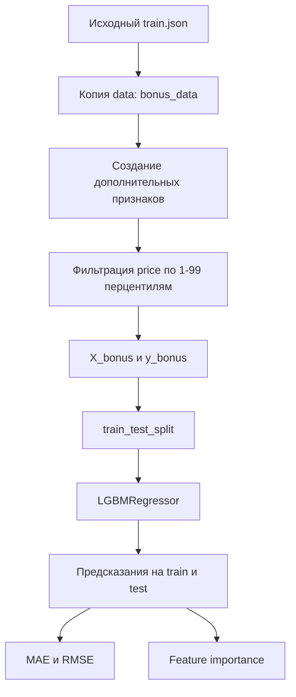
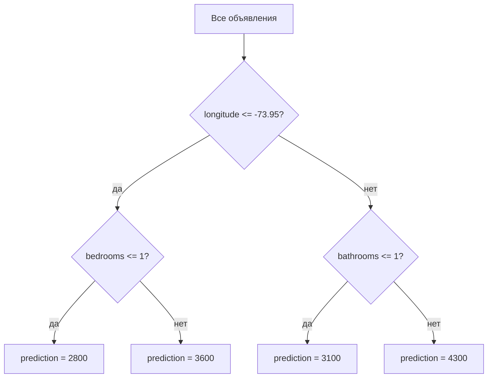
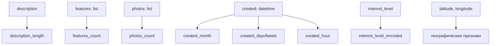
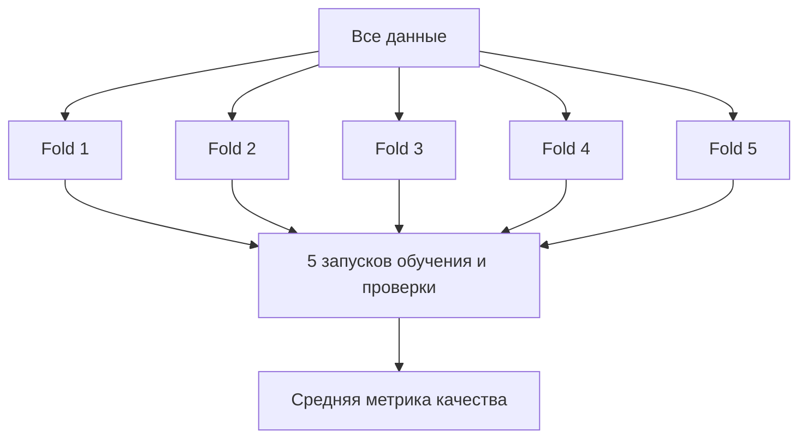

# Бонусная часть ML1: подробное описание LightGBM-модели

Этот файл объясняет бонусный раздел из `ML1_solution_ru.ipynb`: модель `LightGBM` на расширенном наборе признаков.  
Цель файла — не только описать код, но и дать теорию, терминологию, схемы и таблицы, чтобы бонусную часть было легко понять и защитить на peer review.

## 1. Где бонус находится в ноутбуке

Бонус добавлен в конец ноутбука:

```text
ML1_solution_ru.ipynb
└── Бонус: модель LightGBM на расширенном наборе признаков
```

В обязательной части проекта по заданию обучались:

- `linear_regression`;
- `decision_tree`;
- `naive_mean`;
- `naive_median`.

В бонусной части дополнительно обучается:

- `lightgbm_bonus`, то есть `LGBMRegressor`.

## 2. Зачем вообще нужен бонус

В обязательной части ML1 модели обучались только на двух признаках:

```text
bathrooms
bedrooms
```

Это учебное ограничение. Оно помогает понять базовый pipeline машинного обучения:

```text
данные -> признаки -> train/test split -> модель -> предсказания -> метрики
```

Но реальная цена аренды зависит не только от количества спален и ванных комнат. В исходном датасете есть больше полезной информации:

- координаты квартиры;
- количество фотографий;
- длина описания;
- количество удобств;
- дата публикации;
- уровень интереса пользователей.

Бонусная часть показывает, что качество модели можно улучшить двумя путями:

1. использовать более сильный алгоритм;
2. создать больше информативных признаков.

## 3. Как бонус связан с заданием

В задании есть пункт:

```text
5.6 Additional
You can practice with all the data in your starting dataset.
Use and generate all the features you want.
```

Бонусная часть относится именно к этому пункту.

| Часть задания | Что сделано в бонусе |
| --- | --- |
| Additional | Использованы дополнительные столбцы исходного датасета |
| Additional | Созданы новые признаки из текста, списков и даты |
| Additional | Обучена дополнительная модель `LightGBM` |
| Additional | Качество бонусной модели сравнено с обязательными моделями |

## 4. Общая схема бонусного pipeline



## 5. Термины, которые встречаются в бонусе

| Термин | Значение |
| --- | --- |
| `bonus_data` | Копия исходного датасета, в которой создаются дополнительные признаки |
| `feature` | Признак, то есть входная переменная для модели |
| `target` | Целевая переменная, которую предсказываем; здесь это `price` |
| `feature engineering` | Создание новых признаков из исходных данных |
| `train` | Обучающая выборка |
| `test` | Тестовая выборка |
| `regression` | Задача предсказания числового значения |
| `LGBMRegressor` | Регрессионная модель LightGBM |
| `boosting` | Метод, где много слабых моделей последовательно улучшают друг друга |
| `MAE` | Средняя абсолютная ошибка |
| `RMSE` | Корень из средней квадратичной ошибки |
| `feature importance` | Оценка важности признаков для модели |

## 6. Почему используется LightGBM

`LightGBM` — библиотека для градиентного бустинга над деревьями решений.

Она хорошо подходит для табличных данных, потому что:

- умеет находить нелинейные зависимости;
- умеет учитывать взаимодействия признаков;
- обычно даёт сильное качество на structured/tabular data;
- быстро обучается;
- может работать с большим количеством признаков;
- возвращает важности признаков.

В обязательной части LightGBM не требовался, но библиотеку нужно было импортировать. Бонусная часть показывает осмысленное применение этой библиотеки.

## 7. Что такое дерево решений

LightGBM строится на деревьях решений, поэтому сначала важно понять дерево.

**Дерево решений** — модель, которая делает последовательность разбиений по условиям.

Упрощённый пример:

```text
если longitude <= -73.95:
    если bedrooms <= 1:
        предсказать 2800
    иначе:
        предсказать 3600
иначе:
    если bathrooms <= 1:
        предсказать 3100
    иначе:
        предсказать 4300
```

Схематично:



Обычное дерево решений уже использовалось в обязательной части как `DecisionTreeRegressor`.

## 8. Что такое бустинг

**Бустинг** — это метод ансамблевого обучения.

**Ансамбль** — модель, состоящая из нескольких моделей.

Идея бустинга:

1. обучить простую модель;
2. посмотреть, где она ошибается;
3. обучить следующую модель исправлять ошибки предыдущей;
4. повторить много раз;
5. сложить результаты многих моделей.


В градиентном бустинге каждое следующее дерево учится уменьшать ошибку всего ансамбля.

## 9. Что такое градиентный бустинг

**Градиентный бустинг** — разновидность бустинга, где новые деревья добавляются так, чтобы двигаться в сторону уменьшения функции потерь.

**Функция потерь** — численная мера ошибки модели во время обучения.

Для регрессии часто используется ошибка, связанная с разницей:

```text
y_true - y_pred
```

Градиентный бустинг постепенно улучшает предсказание:

```text
prediction_0 = простое начальное предсказание
prediction_1 = prediction_0 + вклад дерева 1
prediction_2 = prediction_1 + вклад дерева 2
prediction_3 = prediction_2 + вклад дерева 3
...
```

Чем больше деревьев, тем потенциально сильнее модель, но тем выше риск переобучения.

## 10. Какие признаки созданы в бонусе

В бонусной части используются такие признаки:

| Признак | Откуда взят | Что означает |
| --- | --- | --- |
| `bathrooms` | исходный датасет | количество ванных комнат |
| `bedrooms` | исходный датасет | количество спален |
| `latitude` | исходный датасет | широта |
| `longitude` | исходный датасет | долгота |
| `interest_level_encoded` | `interest_level` | закодированный уровень интереса |
| `description_length` | `description` | длина текстового описания |
| `features_count` | `features` | количество удобств/особенностей |
| `photos_count` | `photos` | количество фотографий |
| `created_month` | `created` | месяц публикации объявления |
| `created_dayofweek` | `created` | день недели публикации |
| `created_hour` | `created` | час публикации |

## 11. Почему эти признаки могут быть полезны

### `bathrooms` и `bedrooms`

Количество комнат прямо связано с размером и классом квартиры.

Обычно квартира с большим количеством спален и ванных комнат дороже.

### `latitude` и `longitude`

Координаты отражают расположение квартиры.

В недвижимости location часто является одним из самых важных факторов цены.

Даже если модель не знает названия района, она может находить закономерности по координатам.

### `interest_level_encoded`

`interest_level` показывает интерес пользователей к объявлению.

Возможные значения:

```text
low
medium
high
```

В коде они превращаются в числа:

```python
{"low": 0, "medium": 1, "high": 2}
```

Этот признак может быть связан с привлекательностью объявления.

Важно: в реальной production-задаче надо аккуратно проверять, можно ли использовать `interest_level` как входной признак. Если это целевая переменная другой задачи или информация из будущего, может возникнуть leakage. В учебном бонусе мы используем его как доступный признак для эксперимента.

### `description_length`

Длина описания может отражать качество объявления.

Очень короткое описание может быть менее информативным. Более подробное описание может помогать пользователю принять решение.

### `features_count`

`features` — список удобств и характеристик квартиры.

Например:

```text
elevator
dishwasher
hardwood floors
laundry in building
```

Чем больше полезных особенностей указано, тем потенциально привлекательнее объект.

### `photos_count`

Количество фотографий может отражать качество объявления.

Объявление с большим числом фотографий часто выглядит более полным и надёжным.

### `created_month`, `created_dayofweek`, `created_hour`

Дата публикации может быть связана с сезонностью и поведением пользователей.

**Сезонность** — регулярные изменения во времени.

Например, рынок аренды может отличаться по месяцам.

## 12. Схема создания признаков



## 13. Почему `price` не используется как признак

`price` — это target.

Модель должна предсказывать `price`, поэтому нельзя использовать `price` как входной признак.

Если добавить `price` в `X`, модель фактически получит правильный ответ на входе. Это будет грубая утечка данных.

**Data leakage** — ситуация, когда в обучение попадает информация, которая не должна быть доступна модели при реальном предсказании.

В бонусе:

```python
X_bonus = bonus_data[bonus_columns]
y_bonus = bonus_data["price"]
```

То есть `price` находится только в `y_bonus`, а не в `X_bonus`.

## 14. Фильтрация выбросов

Бонус использует те же границы цены, что и обязательная часть:

```text
1-й перцентиль: 1475
99-й перцентиль: 13000
```

Оставляются строки:

```text
1475 <= price <= 13000
```

Зачем:

- убрать крайне редкие цены;
- сделать задачу стабильнее;
- сравнивать модели на той же очищенной логике, что и обязательная часть;
- уменьшить влияние экстремальных значений на RMSE.

## 15. Разделение на train и test

Бонус снова делит данные на train и test:

```python
X_bonus_train, X_bonus_test, y_bonus_train, y_bonus_test = train_test_split(
    X_bonus,
    y_bonus,
    test_size=0.25,
    random_state=21,
)
```

| Параметр | Значение |
| --- | --- |
| `test_size=0.25` | 25% данных идёт в test |
| `random_state=21` | фиксирует случайность для повторяемости |

Важно сравнивать модели по test, потому что test имитирует новые данные.

## 16. Параметры LightGBM в бонусе

В ноутбуке используется:

```python
lightgbm_model = lgb.LGBMRegressor(
    n_estimators=300,
    learning_rate=0.05,
    num_leaves=31,
    random_state=21,
    verbose=-1,
)
```

| Параметр | Что означает |
| --- | --- |
| `n_estimators=300` | количество деревьев в ансамбле |
| `learning_rate=0.05` | скорость обучения, то есть размер вклада каждого дерева |
| `num_leaves=31` | максимальное число листьев в одном дереве |
| `random_state=21` | фиксирует случайность |
| `verbose=-1` | убирает лишний технический вывод |

## 17. `n_estimators`

`n_estimators` — количество деревьев.

Если деревьев слишком мало, модель может недообучиться.

Если деревьев слишком много, модель может переобучиться.

В бонусе выбрано `300` как умеренное значение для учебного эксперимента.

## 18. `learning_rate`

`learning_rate` — размер шага каждого дерева.

Маленький `learning_rate` делает обучение более осторожным.

Обычно:

- маленький `learning_rate` требует больше деревьев;
- большой `learning_rate` быстрее обучается, но может быть менее стабильным.

В бонусе:

```text
learning_rate = 0.05
```

Это довольно осторожное значение.

## 19. `num_leaves`

`num_leaves` контролирует сложность деревьев.

Чем больше листьев, тем более сложные зависимости может выучить модель.

Но слишком большое значение может привести к переобучению.

В бонусе:

```text
num_leaves = 31
```

Это стандартное и достаточно безопасное значение для первого эксперимента.

## 20. Метрики бонусной модели

В бонусе считаются:

- MAE;
- RMSE.

### MAE

**MAE**, или Mean Absolute Error, — средняя абсолютная ошибка.

Формула:

```text
MAE = mean(|y_true - y_pred|)
```

Если `MAE = 435`, значит модель в среднем ошибается примерно на 435 денежных единиц.

### RMSE

**RMSE**, или Root Mean Squared Error, — корень из средней квадратичной ошибки.

Формула:

```text
RMSE = sqrt(mean((y_true - y_pred)^2))
```

RMSE сильнее штрафует большие ошибки.

## 21. Результаты бонуса

После запуска получились такие значения:

| Модель | Train MAE | Test MAE |
| --- | ---: | ---: |
| `lightgbm_bonus` | 393.97 | 435.43 |
| `decision_tree` | 754.31 | 760.64 |
| `linear_regression` | 850.62 | 890.04 |
| `naive_median` | 1087.82 | 1081.37 |
| `naive_mean` | 1140.87 | 1136.28 |

| Модель | Train RMSE | Test RMSE |
| --- | ---: | ---: |
| `lightgbm_bonus` | 599.60 | 693.57 |
| `decision_tree` | 1073.45 | 1092.20 |
| `naive_mean` | 1597.21 | 1598.97 |
| `naive_median` | 1644.28 | 1644.11 |
| `linear_regression` | 1210.47 | 4225.50 |

## 22. Как интерпретировать результаты

LightGBM оказался лучше обязательных моделей:

```text
LightGBM test MAE: 435.43
Decision Tree test MAE: 760.64
```

Разница:

```text
760.64 - 435.43 = 325.21
```

То есть по MAE бонусная модель ошибается в среднем примерно на 325 денежных единиц меньше, чем дерево решений из обязательной части.

По RMSE:

```text
LightGBM test RMSE: 693.57
Decision Tree test RMSE: 1092.20
```

Разница:

```text
1092.20 - 693.57 = 398.63
```

Это тоже заметное улучшение.

## 23. Почему сравнение не совсем честное

Важно понимать: LightGBM стал лучше не только потому, что алгоритм сильнее.

Он также использует больше признаков.

Обязательные модели:

```text
bathrooms
bedrooms
```

Бонусная модель:

```text
bathrooms
bedrooms
latitude
longitude
interest_level_encoded
description_length
features_count
photos_count
created_month
created_dayofweek
created_hour
```

Поэтому вывод должен быть аккуратным:

> Бонусная модель показывает лучшее качество, потому что использует более сильный алгоритм и более информативный набор признаков.

## 24. Feature importance

**Feature importance** — оценка важности признаков для модели.

В LightGBM важность показывает, насколько часто и полезно признак использовался в деревьях.

Результат:

| Признак | Importance |
| --- | ---: |
| `latitude` | 2280 |
| `longitude` | 2227 |
| `description_length` | 851 |
| `bedrooms` | 770 |
| `bathrooms` | 729 |
| `features_count` | 694 |
| `photos_count` | 541 |
| `created_hour` | 373 |
| `interest_level_encoded` | 268 |
| `created_dayofweek` | 168 |
| `created_month` | 99 |

## 25. Как читать feature importance

Самые важные признаки:

```text
latitude
longitude
```

Это логично: расположение квартиры сильно влияет на цену аренды.

Дальше идут:

```text
description_length
bedrooms
bathrooms
features_count
photos_count
```

Это тоже объяснимо:

- размер квартиры важен;
- количество удобств важно;
- фотографии и описание отражают качество объявления;
- хорошо оформленные объявления могут отличаться по цене и привлекательности.

## 26. Ограничения feature importance

Feature importance нельзя воспринимать как доказательство причинности.

Если `latitude` важен, это не значит, что сама широта физически увеличивает цену. Она является прокси для района.

**Прокси-признак** — признак, который косвенно отражает другую важную характеристику.

Например:

```text
latitude + longitude -> район -> цена
```

## 27. Риск leakage в бонусе

Нужно уметь объяснить возможный риск.

В бонусе используется:

```text
interest_level_encoded
```

В исходной Kaggle-задаче `interest_level` обычно является целевой переменной для классификации интереса. Но в нашем учебном задании target — `price`, а `interest_level` явно разрешён для анализа.

Для предсказания цены использование `interest_level` может быть спорным, если в реальном сценарии этот уровень интереса становится известен только после публикации объявления.

На защите можно сказать:

> В бонусной части я использую `interest_level` как доступный учебный признак, потому что он уже присутствует в train.json и использовался в обязательном анализе. В production-сценарии я отдельно проверил бы, доступен ли этот признак в момент предсказания цены, чтобы избежать data leakage.

Это зрелый и аккуратный ответ.

## 28. Что можно было бы улучшить дальше

Бонус можно развивать:

| Идея | Что даст |
| --- | --- |
| One-hot encoding для категорий | Более корректная работа с категориальными признаками |
| TF-IDF для `description` | Использование смысла текста, а не только длины |
| Обработка `features` как текста | Учёт конкретных удобств |
| Географические кластеры | Более сильные признаки района |
| Cross-validation | Более надёжная оценка качества |
| Подбор гиперпараметров | Улучшение LightGBM |
| Early stopping | Защита от переобучения |
| Логарифмирование `price` | Стабилизация скошенного target |

## 29. Что такое cross-validation

**Cross-validation**, или кросс-валидация, — способ оценить модель надёжнее, чем один train/test split.

Идея:

1. данные делятся на несколько частей;
2. модель несколько раз обучается на одних частях и проверяется на другой;
3. результаты усредняются.

Схема:



В ML1 это не обязательно, но в реальных задачах полезно.

## 30. Что такое подбор гиперпараметров

**Гиперпараметры** — настройки модели, которые задаются до обучения.

В LightGBM это, например:

- `n_estimators`;
- `learning_rate`;
- `num_leaves`;
- `max_depth`;
- `min_child_samples`;
- `subsample`;
- `colsample_bytree`.

**Подбор гиперпараметров** — поиск таких настроек, при которых модель работает лучше на validation/test.

Пример идеи:

```python
for learning_rate in [0.01, 0.03, 0.05, 0.1]:
    for num_leaves in [15, 31, 63]:
        ...
```

В более продвинутых проектах используют:

- GridSearchCV;
- RandomizedSearchCV;
- Optuna.

## 31. Как объяснить бонус на peer review

Короткий вариант:

> В обязательной части мы использовали только `bathrooms` и `bedrooms`, как требовало задание. В бонусной части я использовал больше данных из исходного датасета: координаты, количество фото, длину описания, количество features, дату публикации и `interest_level`. Затем обучил `LGBMRegressor`, потому что LightGBM хорошо работает с табличными данными. Бонусная модель улучшила test MAE с 760.64 у дерева решений до 435.43.

Если спросят, почему LightGBM лучше:

> Он строит ансамбль деревьев и последовательно исправляет ошибки предыдущих деревьев. Кроме того, он использует больше информативных признаков, особенно координаты, которые сильно связаны с ценой недвижимости.

Если спросят, честно ли сравнение:

> Не полностью, потому что LightGBM использует больше признаков. Поэтому вывод такой: бонус показывает, что расширение признаков и более сильная модель могут заметно улучшить качество.

Если спросят про риск `interest_level`:

> В учебном проекте это допустимый признак для анализа, но в реальном production-сценарии надо проверить, известен ли `interest_level` в момент предсказания цены. Если он появляется только после публикации объявления, его нельзя использовать для предсказания стартовой цены.

## 32. Итоговый вывод

Бонусная часть показывает полный улучшенный ML-подход:


Главная идея:

> Качество модели зависит не только от алгоритма, но и от признаков.

В обязательной части мы научились строить базовый pipeline.

В бонусной части мы показали, как этот pipeline можно усилить:

- добавить feature engineering;
- использовать LightGBM;
- сравнить результат с baseline;
- проанализировать важность признаков;
- сделать аккуратные выводы.
